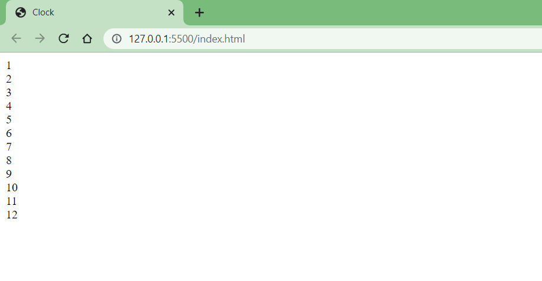
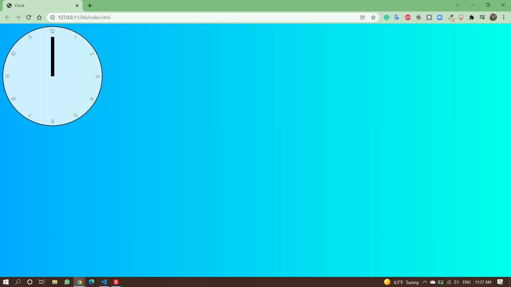
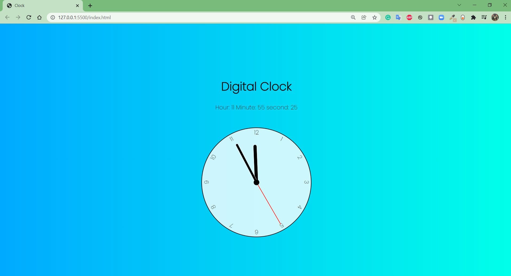

# Clock-with-Javascript
## __This is a Web-Based-Project__

## languages Used:
1. HTML 
2. CSS
3. Javascript

### First, Baseic HTML code is written to dispaly the clock number:

```
<div class="clock">
        <div class="hand hour" data-hour-hand=""></div>
        <div class="hand minute" data-minute-hand=""></div>
        <div class="hand second" data-second-hand=""></div>
        <div class="number number1">1</div>
        <div class="number number2">2</div>
        <div class="number number3">3</div>
        <div class="number number4">4</div>
        <div class="number number5">5</div>
        <div class="number number6">6</div>
        <div class="number number7">7</div>
        <div class="number number8">8</div>
        <div class="number number9">9</div>
        <div class="number number10">10</div>
        <div class="number number11">11</div>
        <div class="number number12">12</div>
</div>
```


### second added the styles to the design.

1. circle was made.
2. numbers are put in their specifc location using Transform: rotate() property
3. clock hands are filled with color and specific length.
<hr>
<br>



### Finally, locating the design in the center of the page (horizontally and vertically) and adding Js code to animate the clock according to the local time.
<hr>
<br>



<hr>
<hr>
 
# You can Found it online through the link below:

[Link text Here](https://onlice-clock-js.netlify.app/)

 